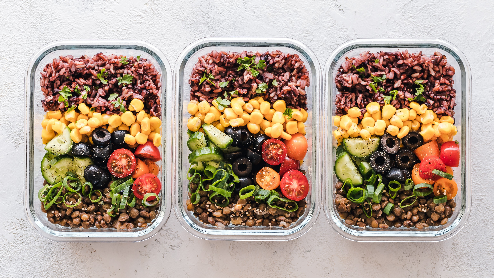

Meal prepping: It's one of those things that you know you should do. (Healthy food that also saves you money? Yes!) But actually doing it is another story. Maybe you tried it for a week or two and have since sworn off anything resembling chicken, brown rice, and broccoli ever again. Or maybe you know a few healthy friends who are religious about their #MealPrepSundays, and you think, "Ah, I wish I actually committed to doing that, too." Regardless, we're going to come out and say it—meal prep can be a bit overwhelming. Life can get in the way of even the best of intentions. But here's the thing: Meal prep will always include some level of, well, prepping and planning. But it doesn't need to be difficult, it doesn't need to take an entire day (ack, Sunday Scaries!), and it certainly doesn't need to suck.

To prove it, we teamed up with healthy chef, YouTube foodie, and meal-prep pro Alyssa Gagarin to challenge you to make meal prep a priority this month. Don't know how to even start? Don't worry. Gagarin is here to show you how to set up your kitchen (and your grocery list) for success with the proper tools, food, and cooking plan. Along the way, you'll learn some genius hacks like what to prep now and what should wait, mistakes you never want to make, how to put together the perfectly balanced meal, what you can quickly do the night before for easier and healthier mornings, and even how to turn your freezer into your meal-prep BFF.

Below you'll find useful videos, easy-to-understand tips and strategies, and healthy recipe ideas for easy dinners, healthy lunches, and quick and nutritious breakfasts—just consider this your complete guide to healthy and efficient meal prep.

By the end of the month, you'll feel like a slicing, cooking, and packing pro and you'll probably save some money and eat healthier, too. Before you know it, meal prep will go from something intimidating to something that's actually pretty fun. (Once you've conquered all the basics this month, challenge yourself to a clean-eating 30-day meal-prep challenge that will open your eyes to how delicious this can actually be.)

How to get started: First thing, Gagarin says, is to have a look at your stockpile of containers and on-hand kitchen tools. What good is all that meal prepping if you don't have containers to put your meal in? A variety of glass or BPA-free plastic containers in different shapes and sizes is crucial (don't forget tiny ones for dressing and sauces, freezer-friendly options, and mason jars). And check to make sure you have the usual kitchen suspects such as aluminum foil, plastic wrap, cutting boards, mixing bowls, measuring cups, spatulas, and sharp knives. A blender and mandoline will make your life a whole lot easier, too.

Next up, consider your schedule for the upcoming week and plan accordingly. For example, are you meeting friends for dinner one night? Did you just join a healthy lunch club at work? How much time do you have in the morning for breakfast? This will determine the number of meals you'll need. (Beginners, feel free to start small with ready-to-go breakfasts, a lunch or two, and a few dinners.) When deciding on recipes, think about A. how long they take to make; B. what pots and pans you'll be using (avoid recipes that require the same pot for faster prepping); and C. if the ingredients in the meals can be mixed and matched so you aren't eating the same thing every day.

Finally, make a shopping list and plot your meal-prep strategy. Review what you already have in your pantry and fridge and jot down what you'll need to buy. (You should always have staples such as healthy cooking oils and vinegar, eggs, almond meal or breadcrumbs, chia seeds, onions, and garlic—plus, lemons and limes and your favorite fresh herbs and dried spices for easy seasoning.) When you get home, map out your meal-prep timeline, so you can get the longest-cooking meal going first (maybe a big pot of chili), while you're roasting sweet potatoes in the oven, and chopping veggies for salads, soups, and stir-fries on the counter. And check out the graphic below for an easy way visualize your day-to-night meal-prep timeline.

Okay, you're officially ready to meal prep. Go on, and conquer that kitchen.

source: [https://www.shape.com/](https://www.shape.com/healthy-eating/cooking-ideas/30-day-meal-prep-challenge-tips-recipes-for-beginners?did=349925-20190311&utm_campaign=shape-daily_newsletter&utm_source=shape.com&utm_medium=email&utm_content=031119&cid=349925&mid=19216737924)
