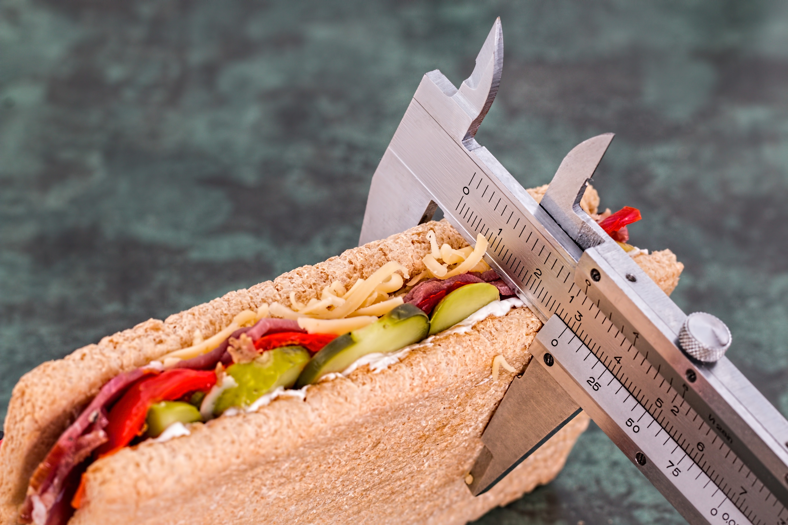

If you think losing weight and eating right is all about counting calories and tracking everything you eat, think again. Turns out, people who eat a lot of vegetables and whole foods (foods that haven't been processed or refined and that are free of additives) lost significant amounts of weight over the course of a year without restricting the quantity of food they consumed, according to a new study published in JAMA on Tuesday.

The research by scientists at the Stanford Prevention Research Center split 600 people into two diet groups. One group followed a low-carb diet while the other adhered to a low-fat diet. (BTW, find out why women need fat.)

Both groups were asked to focus on consuming high-quality foods and to avoid processed or refined foods as well as anything that might have added sugars such as white bread, bagels, and sugary snacks. To help stay on track over the course of a year, they met with dietitians who helped guide them and encouraged home cooking. (Did you know that processed food can put you in a bad mood?)

But here's the kicker: Everyone was also told not to worry about counting calories or limiting portion sizes. (Related: 6 Signs You Need to Change Your Diet.)

After a year, researchers found that both groups lost a significant amount of weight. People who followed the low-carb diet lost an average of 13 pounds, while the low-fat group lost an average of 11.7 pounds. On top of the weight loss, everyone saw an improvement in their overall health, such as lower blood pressure, blood sugar, and body fat. (Related: 15 Simply Brilliant Healthy Eating Tips)

The takeaway? Diet quality is more important for both weight control and long-term well-being compared to diet quantity.

It's already commonly understood that very restrictive dieting and excessive calorie counting can lead to greater attrition rates and negative relationships with food, such as eating guilt. So coupled with this research, it would be prudent for nutritionists and health care providers to focus more on training clients and patients to rethink the quality of their food rather than focusing on portion sizes or total calories.

That isn't to say that calories don't matter at all. In fact, researchers made it a point to note that by the end of the study, both groups were eating less food simply because they had made major changes to their diet and were getting used to eating healthier. The point is that calories shouldn't be the only focus when it comes to weight loss. (If you need more convincing, here are a few other reasons why you should stop counting calories.)

source: [https://www.shape.com/](https://www.shape.com/weight-loss/tips-plans/counting-calories-probably-wont-help-you-lose-weight?did=338875-20190212&utm_campaign=shape-daily_newsletter&utm_source=shape.com&utm_medium=email&utm_content=021219&cid=338875&mid=18505847016)
